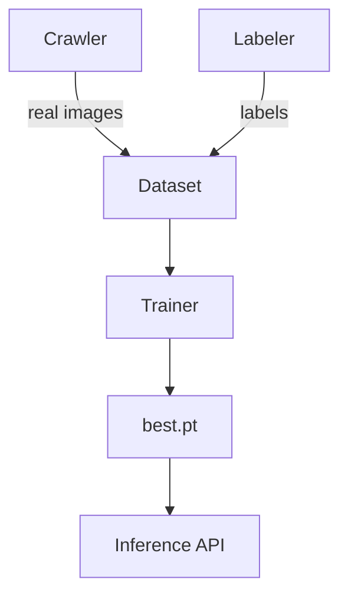

# AGENTS Specification – Captcha Dataset & Model Pipeline

## Objective

从YBU教务系统爬取≥5000张真实验证码样本，训练视觉模型返回`{ "captcha": "AB1cD" }`，并提供简单的预测接口。

## Global Context

* **Target captcha**: 5 uppercase alphanumerics, fisheye bulge, central red vertical line, random noise/blur
* **Dataset root**: `dataset/`
* **Codebase language**: Python 3.10
* **Libraries**: Pillow, requests, NumPy, Torch, TorchVision, OpenCV‑Python, Playwright
* **Hardware**: Any CUDA‑capable GPU; CPU fallback allowed

---

## Agents

### 1. Crawler

| Field       | Value                                                                                            |
| ----------- | ------------------------------------------------------------------------------------------------ |
| **role**    | `crawler`                                                                                        |
| **goal**    | 从YBU教务系统爬取真实验证码图片并进行标注，建立高质量训练数据集                                            |
| **inputs**  | YBU教务系统验证码接口，爬取参数配置                                                                    |
| **tools**   | `requests`, `Playwright`, `Pillow`, `OpenCV-Python`                                              |
| **outputs** | `dataset/real/*.jpg`, `real_labels.txt`                                                          |
| **success** | ≥5000张真实验证码样本，完整人工标注                                                                  |
| **ethics**  | 遵守学校ToS，QPS ≤ 3，记录所有请求，仅用于学术研究                                                    |

**System Prompt**

```system
You are Crawler, a responsible data collection agent. Fetch captcha images from YBU educational system with rate limiting (QPS ≤ 3), respect ToS, log all requests, save images with timestamps, and facilitate manual labeling process.
```

Environment variables

* `N_SAMPLES` (default `5000`)
* `DATASET_DIR` (default `dataset/real`)
* `QPS_LIMIT` (default `3`)
* `YBU_CAPTCHA_URL` (教务系统验证码接口)

---

### 2. Labeler

| Field       | Value                                                           |
| ----------- | --------------------------------------------------------------- |
| **role**    | `labeler`                                                       |
| **goal**    | 为爬取的验证码图片提供人工标注，确保标注质量                             |
| **inputs**  | `dataset/real/*.jpg`                                            |
| **outputs** | `real_labels.txt`, 高质量标注数据                                  |
| **success** | 所有图片完成人工标注，标注准确率≥99%                                   |

---

### 3. Trainer

| Field       | Value                                                                                      |
| ----------- | ------------------------------------------------------------------------------------------ |
| **role**    | `trainer`                                                                                  |
| **goal**    | 基于真实验证码数据集训练CRNN‑CTC模型，验证集准确率≥98%                                           |
| **inputs**  | `dataset/real/*`, `hyperparams.yaml`                                                       |
| **outputs** | `models/best.pt`, `metrics.json`                                                           |
| **tools**   | PyTorch, torchmetrics, (optional) Weights & Biases                                         |

**System Prompt**

```system
You are Trainer. Load real captcha images & labels, build a CRNN (backbone=ResNet18, seq_encoder=BiLSTM, num_classes=len(CHARSET)+1). Train with CTC loss on real data; save models/best.pt and metrics.json.
```

---

### 4. Inference

| Field       | Value                                                          |
| ----------- | -------------------------------------------------------------- |
| **role**    | `inference`                                                    |
| **goal**    | Serve HTTP `POST /predict` with multipart image → JSON captcha |
| **runtime** | FastAPI, `models/best.pt`                                      |
| **success** | P99 latency < 80 ms on GPU                                     |

---

### 5. Orchestrator

Coordinates execution order: **Crawler → Labeler → Trainer → Inference**. Triggers Trainer again when new data appear.

---

## Data‑Flow Diagram



---

## Milestones

1. **Day 1-3:** Crawler收集5000+真实验证码样本
2. **Day 4-5:** Labeler完成所有样本标注
3. **Day 6-14:** Trainer基于真实数据训练，达到≥98%验证准确率
4. **Day 15:** Inference API容器化并完成端到端测试

---

## Security & Compliance

* 爬虫操作严格遵守学校服务条款和访问频率限制
* 在`.secrets/`中存储cookies/tokens，排除版本控制
* 发布前清除数据集中的任何用户识别信息
* 所有数据仅用于学术研究，禁止商业用途

---

*End of AGENTS.md*
